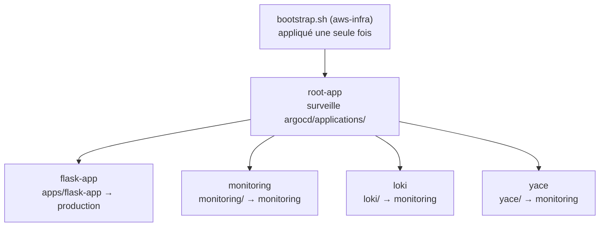

# flask-gitops — Déploiement GitOps de Veille Immobilière

Ce dépôt décrit **l'état désiré du cluster EKS de production** : l'application, sa supervision et la collecte de ses logs. Argo CD le surveille et applique automatiquement chaque commit de `main` ; aucun `kubectl apply` ni `helm upgrade` n'est lancé à la main.

| Dépôt | Rôle |
|---|---|
| [flask-app](https://github.com/Styyde/flask-app---public-veille-immobiliere) | Code applicatif, image Docker, CI/CD — **README principal** et architecture d'ensemble |
| **flask-gitops** *(ce dépôt)* | Ce qui tourne dans le cluster |
| [aws-infra](https://github.com/Styyde/aws-infra---public-Veillle-immobiliere) | Infrastructure AWS (Terraform) et installation d'Argo CD |

## Sommaire

- [Contenu du dépôt](#contenu-du-dépôt)
- [Fonctionnement GitOps](#fonctionnement-gitops)
- [Haute disponibilité](#haute-disponibilité)
- [Sécurité](#sécurité)
- [Observabilité](#observabilité)
- [Intégration continue](#intégration-continue)
- [Dépendances avec aws-infra](#dépendances-avec-aws-infra)
- [Opérations courantes](#opérations-courantes)
- [Limites connues](#limites-connues)

## Contenu du dépôt

| Dossier | Contenu | Namespace |
|---|---|---|
| `argocd/root-app.yaml` | Application racine (*App of Apps*) | `argocd` |
| `argocd/applications/` | Une Application Argo CD par composant | `argocd` |
| `apps/flask-app/` | Chart Helm de l'application : Deployment, Service, Ingress, HPA, PodDisruptionBudget, ExternalSecret, ServiceMonitor, règles d'alerte | `production` |
| `monitoring/` | kube-prometheus-stack 65.5.1 (Prometheus, Alertmanager, Grafana), tableaux de bord, alertes RDS et ALB | `monitoring` |
| `loki/` | Loki 7.3.0 (stockage des logs sur S3) et Grafana Alloy 1.11.1 (collecte) | `monitoring` |
| `yace/` | YACE 0.38.0 : métriques CloudWatch de RDS et de l'ALB pour Prometheus | `monitoring` |

`monitoring`, `loki` et `yace` sont des charts *wrapper* : ils épinglent la version d'un chart officiel et n'ajoutent que la configuration propre au projet.

## Fonctionnement GitOps

### App of Apps



La `root-app` est le seul manifest appliqué à la main, une fois, par le script de bootstrap d'aws-infra. Elle déploie ensuite toutes les Applications de `argocd/applications/` : ajouter un composant revient à ajouter un fichier dans ce dossier.

Toutes les Applications sont synchronisées automatiquement avec `prune` et `selfHeal` : une modification faite à la main dans le cluster est annulée, une ressource retirée de Git est supprimée. Deux réglages particuliers :

- `flask-app` ignore `spec.replicas` du Deployment, piloté par l'HPA ; sinon Argo CD rétablirait sans cesse la valeur de Git et annulerait les décisions de l'autoscaler.
- `monitoring` utilise le *Server-Side Apply* : les CRD de kube-prometheus-stack sont trop volumineuses pour l'apply classique.

### Livraison d'une version

1. La CI de flask-app pousse l'image `veille-immo-api:<sha>` dans ECR.
2. Elle remplace `image.tag` dans `apps/flask-app/values.yaml` et commite (`Update image tag to <sha>`).
3. Argo CD détecte le commit et lance un *rolling update* : un nouveau pod ne reçoit du trafic qu'une fois sa readiness probe validée.
4. La CI vérifie sur `/health` que le nouveau tag est bien servi.

**Retour arrière** : `git revert` du commit de tag. Aucune image n'est reconstruite.

## Haute disponibilité

Réglages de `apps/flask-app/values.yaml` :

| Mécanisme | Réglage | Protège contre |
|---|---|---|
| Répliques | 2 au minimum | La perte d'un pod |
| HorizontalPodAutoscaler | 2 à 5 pods, cibles CPU 70 % et mémoire 80 % | Les pics de charge |
| PodDisruptionBudget | `minAvailable: 1` | Le drain d'un nœud, la mise à jour du node group |
| Anti-affinité de zone | Répartition préférentielle des pods sur les zones de disponibilité | La perte d'une zone |
| Probes | readiness et liveness sur `/health` | Un pod bloqué ou privé d'accès à la base |
| Requests / limits | 250m / 256Mi demandés, 500m / 512Mi au plus | La contention entre pods ; base de calcul de l'HPA |
| Ingress ALB | `target-type: ip`, health check sur `/health` | Le routage vers un pod défaillant |

L'anti-affinité est *preferred* et non *required* : avec deux nœuds, une règle stricte pourrait laisser un pod en `Pending`. L'ajout de nœuds (Cluster Autoscaler) et la redondance du réseau et de la base sont gérés dans [aws-infra](https://github.com/Styyde/aws-infra---public-Veillle-immobiliere#haute-disponibilité).

## Sécurité

- **Aucun secret dans ce dépôt** : des `ExternalSecret` (External Secrets Operator) lisent AWS Secrets Manager et créent les Secrets Kubernetes — `DATABASE_URL` de l'application, identifiants admin de Grafana, webhook Slack d'Alertmanager. Les valeurs, générées par Terraform, sont relues toutes les heures.
- **Aucune clé AWS dans les pods** : Loki (accès S3) et YACE (lecture CloudWatch) utilisent IRSA, un rôle IAM dédié par ServiceAccount.
- **HTTPS** : TLS terminé sur l'ALB avec le certificat ACM `*.kolynois.com`, découvert automatiquement ; HTTP redirigé vers HTTPS.
- **Argo CD non exposé** : service `ClusterIP`, joignable uniquement par port-forward depuis le bastion SSM.
- **Contrôle avant production** : la CI ci-dessous bloque un manifest invalide avant qu'Argo CD ne l'applique.

## Observabilité

| Signal | Collecte | Restitution |
|---|---|---|
| Métriques applicatives | ServiceMonitor sur `/metrics`, toutes les 30 s | Prometheus, Grafana |
| Métriques AWS (RDS, ALB) | YACE interroge CloudWatch toutes les 5 min | Tableaux de bord *RDS* et *ALB* |
| Logs des pods | Alloy (DaemonSet, lecture par l'API Kubernetes) | Loki sur S3, rétention 14 jours |
| Alertes | PrometheusRules | Alertmanager vers Slack |

Grafana est servie sur `grafana.kolynois.com`, derrière le même ALB que l'application ; la source de données Loki et les tableaux de bord sont provisionnés par ConfigMap.

Les alertes `critical` partent sur `#alerts-veille-immo-critical` (rappel toutes les heures), les autres sur `#alerts-veille-immo` (toutes les 4 heures) :

| Périmètre | Alertes |
|---|---|
| Application | pod injoignable, plus de 5 % de réponses 5xx, latence p95 > 1 s, CPU ou mémoire > 90 % de la limite, redémarrages, `ImagePullBackOff` |
| RDS | CPU > 80 %, moins de 2 Gio libres, plus de 80 connexions |
| ALB | 5xx des cibles > 5 %, 4xx > 10 %, 5xx émis par l'ALB lui-même |

## Intégration continue

`main` étant déployée telle quelle en production, `.github/workflows/validate.yml` contrôle chaque push et chaque pull request :

| Job | Vérification |
|---|---|
| `yamllint` | Syntaxe YAML de tout le dépôt |
| `helm-lint-and-template` | `helm lint` et `helm template` des charts `apps/flask-app`, `monitoring` et `yace` (CRD simulées), puis validation des manifests rendus par **kubeconform** (schémas Kubernetes 1.33) |
| `argocd-application-manifests` | Chaque Application pointe vers un dossier existant |

## Dépendances avec aws-infra

Le bootstrap d'aws-infra installe ce dont ces manifests ont besoin : Argo CD et la `root-app`, AWS Load Balancer Controller, External Secrets Operator et le `ClusterSecretStore` `aws-secretsmanager`, metrics-server (requis par l'HPA), ExternalDNS, Cluster Autoscaler et la StorageClass `gp3` par défaut (volume de Loki).

Certaines valeurs de ce dépôt doivent correspondre aux sorties Terraform :

| Valeur | Emplacement | Sortie Terraform |
|---|---|---|
| Dépôt d'images | `apps/flask-app/values.yaml` (`image.repository`) | `ecr_repository_url` |
| Secret de la base | `apps/flask-app/values.yaml` (`externalSecret.remoteRef.key`) | `db_credentials_secret_arn` (nom du secret) |
| Secret Grafana | `monitoring/templates/externalsecret-grafana.yaml` | `grafana_admin_secret_name` |
| Webhook Slack | `monitoring/templates/externalsecret-alertmanager-slack.yaml` | `alertmanager_slack_secret_name` |
| Rôle IAM et bucket de Loki | `loki/values.yaml` | `loki_role_arn`, `loki_logs_bucket_name` |
| Rôle IAM de YACE | `yace/values.yaml` | `yace_role_arn` |

## Opérations courantes

```bash
# Vérifier un chart avant de pousser
helm dependency update monitoring
helm lint apps/flask-app
helm template test apps/flask-app \
  --api-versions monitoring.coreos.com/v1 --api-versions external-secrets.io/v1

# Accéder à Argo CD depuis le bastion (voir aws-infra)
kubectl port-forward -n argocd svc/argocd-server 8080:443
```

## Limites connues

- Loki tourne en un seul pod (*SingleBinary*) : les logs déjà stockés sont sur S3, mais l'ingestion s'interrompt pendant un redémarrage de ce pod.
- La liveness probe interroge `/health`, qui dépend de la base : une panne de RDS ferait redémarrer tous les pods. Un endpoint de liveness sans dépendance externe serait plus adapté.
- Les pods de l'application n'ont pas de `securityContext` restrictif (exécution en root).
- Le chart `loki` n'est pas encore validé par la CI.
